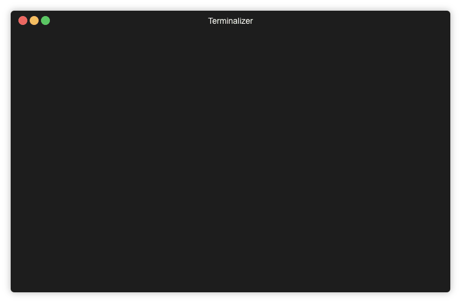

# rename files

A cli tool to safely batch rename files.



## Install

Shell command `curl -L https://git.io/fjaxx | repo=ysmood/renamefiles bin=renamefiles sh`

or use golang:

```bash
go get github.com/ysmood/renamefiles
```

## Usage

```bash
renamefiles --help-long

# normally command without arguments is enough
renamefiles
```

The tool will display a preview and ask if you want to apply the batch operation.

A log file will be created, you can use it to revert batch operation in case mistakes.
